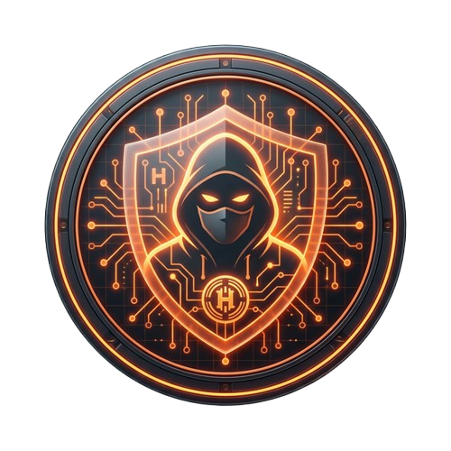

<p align="center">
  
</p>

<h1 align="center">Heist Bot</h1>

<p align="center">
  <strong>The All-in-One Twitch Stream Management Platform</strong><br/>
  <sub>Interactive games · Chat moderation · Custom commands · Timer automation · One-click Twitch login</sub>
</p>

<p align="center">
  <a href="https://github.com/Benjamin-Web/Heist_Bot_Updates/releases"></a>
  
  
  
</p>

<p align="center">
  <a href="https://www.heist-bot.pro">Website</a> •
  <a href="https://discord.gg/FV83Fcu3V3">Discord</a> •
  <a href="https://ko-fi.com/ronincannons">Ko-fi / PRO</a> •
  <a href="#deutsch">Deutsch</a>
</p>

---

## 🚀 What is Heist Bot?

Heist Bot is a **professional desktop application** for Twitch streamers that replaces multiple tools in one package. Run interactive heist games, moderate your chat, set up custom commands, automate timed messages — all from a single, beautiful dashboard.

> **No more juggling StreamElements, Nightbot, and separate bots.** Heist Bot handles it all.

---

## ✨ Core Features

### 🎮 Interactive Heist Game
Viewers pool their currency and rob banks together. Win big or lose it all — with full animated OBS overlay, sound effects, and a dynamic robber parade.

### 🔐 One-Click Twitch Login
No more copy-pasting OAuth tokens. Click **"Login with Twitch"** and you're connected. Channel, token, and Helix API are auto-configured.

### 🛡️ Chat Moderation (Spam Filter)
Built-in protection against caps spam, emoji floods, repeated messages, and links from non-subscribers. Fully configurable.

### ⌨️ Custom Chat Commands
Create unlimited custom commands (`!discord`, `!socials`, `!ad`, etc.) with support for text responses, URLs, and sound alerts.

### ⏱️ Timer Commands
Automated recurring chat messages at custom intervals. Perfect for promoting Discord, social media, or game commands.

### 🎫 Raffle System
Run fair giveaways with ticket pricing, sub-only mode, minimum subscription requirements, and automatic redraw on unclaimed wins.

### 📊 Statistics Dashboard
Track heist win rates, participation trends, raffle history, and top winners with interactive charts and filters.

### 🧟 Zombie Dog Mode
An alternative game mode where zombie dogs attack a sausage factory. Different mechanics, custom Spine animations, and a unique theme.

### 🔔 Stream Alerts
Animated OBS overlay for Follow, Sub, Resub, Gift-Sub, Cheer and Raid events — with configurable duration, volume, animations and custom sounds.

### 🎰 Channel-Points Manager
Create, edit and delete Twitch channel point rewards straight from the dashboard, and link any reward to a custom command.

### 📣 Raid Shoutout & Auto-Clip _(PRO)_
Auto-shoutout incoming raiders and automatically clip your hype moments when chat activity spikes.

### 🔢 Counters & Activity Log
Streamer counters (`!deaths`, `!wins`), a searchable activity log _(CSV/JSON export is PRO)_, and a persistent stream to-do list. Up to **3 counters free**, unlimited with PRO.

### 🌐 Mod Web Dashboard _(NEW in 1.7.0)_
Invite moderators who configure the bot from their browser at **[mod.heist-bot.pro](https://mod.heist-bot.pro)** — no desktop install required for the team. Per-module permissions, audit log, all 5 languages. Free for **1 mod**, unlimited with PRO.

### 👥 Team Management _(NEW in 1.7.0)_
A dedicated "Team" tab where you invite mods by Twitch login (Helix lookup is automatic), assign per-module permissions (7 permissions to choose from), and edit or remove them anytime. Every mod action is recorded in the audit log.

### 🔁 Counter Overlay _(NEW in 1.7.0)_
A new transparent OBS browser source that displays your counters with live WebSocket updates and URL-parameter filters for layout/theme.

### ⏸️ Heist Game Master Toggle _(NEW in 1.7.0)_
A single checkbox to silence the heist mini-game while keeping all other bot features (raffles, counters, alerts, polls, …) running. Perfect for streamers who just want the moderation + automation features.

### 🌍 5 Languages
Full localization for **German**, **English**, **Spanish**, **Russian**, and **Chinese** — switchable with one click in both the desktop app and the mod web dashboard.

---

## 📸 Screenshots

<p align="center">
  <em>Dashboard • Settings • OBS Overlay</em>
</p>

| Dashboard | OBS Overlay |
|:---------:|:-----------:|
| Modern dark UI with real-time heist status, leaderboard, and event log | Animated robber parade with sound effects and bank scene |

---

## 🏗️ Architecture

```
┌─────────────────────────────────────────────────────┐
│                   Electron Main Process             │
│  ┌──────────┐  ┌──────────┐  ┌───────────────────┐  │
│  │  main.js  │  │  bot.js   │  │  gameLogic.js     │  │
│  │  (IPC)    │  │  (tmi.js) │  │  (Heist Engine)   │  │
│  └────┬─────┘  └────┬─────┘  └───────────────────┘  │
│       │              │                                │
│  ┌────┴──────────────┴────┐  ┌───────────────────┐  │
│  │  Twitch Helix API      │  │  timerService.js   │  │
│  │  (helixApi.js)         │  │  (Auto Messages)   │  │
│  └────────────────────────┘  └───────────────────┘  │
│       │                                              │
│  ┌────┴────────────────────────────────────────────┐ │
│  │  WebSocket Server (wsServer.js) — Port 8765     │ │
│  └─────────────────────┬───────────────────────────┘ │
└────────────────────────│─────────────────────────────┘
                         │
        ┌────────────────┼────────────────┐
        ▼                ▼                ▼
  ┌──────────┐    ┌──────────┐    ┌──────────────┐
  │ Dashboard │    │   OBS    │    │   Backend    │
  │ Renderer  │    │ Overlay  │    │  (Railway)   │
  │ (HTML/JS) │    │ (Phaser) │    │  Express.js  │
  └──────────┘    └──────────┘    └──────┬───────┘
                                         │
                                   ┌─────┴─────┐
                                   │  Supabase  │
                                   │ PostgreSQL │
                                   └───────────┘
```

---

## ⚡ Quick Start

### Installation (Recommended)

1. **Download** the latest `HeistBot-Setup-x.x.x.exe` from the [Releases Page](https://github.com/Benjamin-Web/Heist_Bot_Updates/releases)
2. **Run** the installer and follow the setup wizard
3. **Launch** Heist Bot and click **"Login with Twitch"**
4. You're live! 🎉

### Development Setup

```bash
# Clone the repository
git clone https://github.com/Benjamin-Web/heist_bot.git
cd heist_bot

# Install dependencies
npm install

# Start in development mode
npm start

# Build for production
npm run build
```

---

## 🛠️ Configuration

### OBS Overlay Setup
1. Add a **Browser Source** in OBS
2. Set the URL to `http://localhost:8765/?lang=en`
3. Resolution: **1920 × 1080**
4. ✅ Enable "Control audio via OBS"

### Spam Filter Settings
| Setting | Default | Description |
|---------|---------|-------------|
| Max Caps | 70% | Percentage of uppercase letters before timeout |
| Max Emojis | 8 | Maximum emojis per message |
| Repeat Threshold | 3 | Identical messages within time window |
| Link Block | On | Block links from non-subscribers |

---

## 🎮 Chat Commands

### Viewer Commands
| Command | Aliases | Description |
|---------|---------|-------------|
| `!raub <bet>` | `!heist <bet>` | Start or join a bank heist |
| `!coins` | `!<currency>` | Check your balance |
| `!toplist` | `!leaderboard` | Show top 5 in chat |
| `!give @user <amount>` | `!schenken` | Transfer currency to another viewer |
| `!raffle <tickets>` | `!ticket` | Buy tickets for the active raffle |
| `!uptime` | — | Show how long the stream has been live |
| `!so <user>` | `!shoutout` | Give another channel a shoutout |
| `!followage <user>` | — | Show how long someone has followed |
| `!heistbot` | `!botinfo` | Show bot version info |
| `!<counter>` | — | Read a streamer counter (e.g. `!deaths`) |

### Moderator Commands
| Command | Description |
|---------|-------------|
| `!top` | Show top 10 leaderboard |
| `!<counter>+` / `!<counter>-` / `!<counter>=N` | Increment / decrement / set a counter |
| Custom commands | Configured via PRO dashboard |

> 💡 A full, grouped overview of every built-in command is available in the dashboard's **Bot Commands** card.

---

## ⭐ PRO Membership

Unlock the full potential of Heist Bot with PRO.

| Feature | Free | PRO |
|---------|:----:|:---:|
| Heist Game (`!heist` / `!raub`) | ✅ | ✅ |
| Raffle System | ✅ | ✅ |
| All OBS Overlays (Heist, Alerts, Counter) | ✅ | ✅ |
| Stream Alerts (Follow/Sub/Cheer/Raid) | ✅ | ✅ |
| Spam Filter (caps / emojis / repeat / links) | ✅ | ✅ |
| Counters | ✅ up to 3 | ✅ unlimited |
| Timer Commands | ✅ up to 3 | ✅ unlimited |
| Activity Log (view) | ✅ | ✅ |
| Twitch One-Click Login | ✅ | ✅ |
| Mod Web Dashboard | ✅ for 1 mod | ✅ all mods |
| Team Management (invite mods) | ✅ 1 mod | ✅ unlimited |
| Audit Log (team activity) | ✅ | ✅ |
| Heist Game Master Toggle | ✅ | ✅ |
| Streaming To-Do List | ✅ | ✅ |
| **Activity Log Export (CSV/JSON)** | — | ✅ |
| **Raid Shoutout Queue** | — | ✅ |
| **Auto-Clip (chat-velocity)** | — | ✅ |
| Custom Commands | — | ✅ |
| Channel-Points Manager | — | ✅ |
| Custom Alert Animations + Sounds (per type) | — | ✅ |
| Excluded Accounts (leaderboard filter) | — | ✅ |
| Advanced Statistics (trends, charts) | — | ✅ |
| Zombie Dog Mode | — | ✅ |
| Visual Polls (Tug-of-War) | — | ✅ |
| AI Chat (`!ask` / `!ai`) | — | ✅ |
| Heist Cooldown Config | — | ✅ |
| Priority Support | — | ✅ |

### How to Activate PRO
1. Visit **[ko-fi.com/ronincannons](https://ko-fi.com/ronincannons)**
2. Purchase the **"Heist Bot PRO"** membership
3. Enter `Twitch: YourUsername` in the Order Note field
4. PRO activates automatically within minutes ✅

---

## 💻 Tech Stack

| Layer | Technology |
|-------|-----------|
| **Desktop App** | Electron 33 |
| **Twitch Chat** | tmi.js |
| **Twitch API** | Helix REST API + EventSub WebSocket |
| **Overlay Engine** | Phaser 3 + Spine Animations + GSAP |
| **Database** | Supabase (PostgreSQL) |
| **Backend** | Express.js on Railway |
| **Auth** | Twitch OAuth 2.0 Implicit + JWT Token Exchange |
| **Auto-Update** | electron-updater (GitHub Releases) |

---

## 🗺️ Roadmap

| Status | Feature |
|:------:|---------|
| ✅ | Interactive Heist Game with OBS Overlay |
| ✅ | Raffle System (Sub-Only, Redraw, Claim Timer) |
| ✅ | Statistics Dashboard with Trends & Charts |
| ✅ | 5 Languages (DE, EN, ZH, ES, RU) |
| ✅ | PRO Membership System (Ko-fi Integration) |
| ✅ | Zombie Dog Game Mode |
| ✅ | Visual Polls & Tug-of-War |
| ✅ | Twitch Helix API Integration |
| ✅ | **One-Click Twitch OAuth Login** |
| ✅ | **Spam Filter (Caps, Emojis, Links, Repeats)** |
| ✅ | **Custom Chat Commands** |
| ✅ | **Timer / Auto-Messages** |
| ✅ | **Stream Alerts (Follow/Sub/Cheer/Raid) + Animated Overlay** |
| ✅ | **Channel-Points Manager (create / edit / link to commands)** |
| ✅ | **Raid Shoutout Queue & Auto-Clip** |
| ✅ | **Counter System & Activity Log Export** |
| ✅ | **Giveaway Templates & Streaming To-Do List** |
| ✅ | **Team-Activity Audit Log** _(1.7.0)_ |
| ✅ | **Counter Overlay** _(1.7.0)_ — separate OBS browser source for `!deaths`, `!wins` etc. |
| ✅ | **Heist Master Toggle** _(1.7.0)_ — use the bot purely for chat / spam / timers / alerts without the heist mini-game |
| ✅ | **Moderator Web Dashboard** _(1.7.0)_ — full feature set: Commands, Timers, Spam, Counters, Alerts at mod.heist-bot.pro |
| ✅ | **Team Management UI** _(1.7.0)_ — invite mods by Twitch login with per-module permissions |
| 🔜 | Hate-Raid & Follow-Bot Protection |
| 🔜 | Smart-Mod (AI-assisted moderation) |
| 🔜 | Tipping / Donations with Stripe |
| 🔜 | Loyalty System (points, levels, shop) |
| 🔜 | Context-Aware AI Chat Responses |

---

## 📝 Changelog

### [1.7.0] — 2026-05-27  ·  _"Team Permissions + Web Dashboard"_

This is a major release that introduces the **Heist Bot Mod Web Dashboard**
at [mod.heist-bot.pro](https://mod.heist-bot.pro). Streamers can now invite
moderators who configure the bot from their browser — no desktop install
required for the team.

#### ✨ New Features
- **Mod Web Dashboard** — A standalone web app where invited mods log in with their Twitch account and configure Custom Commands, Timers, Spam Filter, Counters, and Alerts on behalf of the streamer. Five languages with a topbar language switcher.
- **Team Management** — Dedicated "Team" tab in the desktop app. Invite mods by Twitch login (Helix lookup is automatic), assign per-module permissions, edit and remove them.
- **Team Activity (Audit Log)** — Read-only panel listing every config change made by your mods, with filters by mod, action type and time range.
- **Counter Overlay** — Transparent OBS browser source for `!deaths`, `!wins`, `!throws` etc. with live WebSocket updates and URL-parameter filters for layout/theme.
- **Heist Game Master Toggle** — A single checkbox to silence the heist mini-game while keeping all other bot features running.
- **Cloud-synced configuration** — Spam Filter, Counters and Alerts now sync to Supabase. The desktop loads them on bot start; the web dashboard writes go straight to the cloud.

#### 💰 Pricing Update
Several features now require **PRO**:
- More than **3 Counters** per channel
- More than **1 Mod** per channel (the team feature is FREE for a one-mod team)
- **Activity Log CSV/JSON export** (the activity view itself stays FREE)
- **Raid Shoutout Queue** and **Auto-Clip** automation

The free tier remains generous: heist, raffle, all overlays, spam filter, alerts (with default animation/sound), counter overlay and a one-mod web dashboard are all included.

#### 🔧 Improvements
- **Security**: Row Level Security is now enabled on the `users` and `user_pro_status` tables. The anon key can no longer read license keys.
- **Audit Log** now records the actor's Twitch login instead of the email address.
- **Mod web dashboard** uses a custom remount event for language switching, so changing the language never reloads the page.
- **Reusable PRO-check middleware** — a freshly activated PRO membership is now effective immediately, without waiting for a JWT refresh.

---

### [1.6.1] — 2026-05-20  ·  _"AI Chatbot Fix"_

#### 🐛 Bug Fixes
- **`!ask` / `!ai` AI Chatbot** — The AI chat command now works end to end. It previously failed with "Server error" because the backend AI route was missing, pointed at a dead domain, used the wrong PRO check and never received the user identity. Powered by a new MiniMax-backed backend route.

#### 🔧 Improvements
- **Clearer AI error messages** — Instead of a generic "Server error", `!ask` now reports the actual cause (rate limit, timeout, PRO required, not configured).

---

### [1.6.0] — 2026-05-20  ·  _"The Engagement Update"_

#### ✨ New Features
- **Stream Alerts** — Animated OBS overlay for Follow, Sub, Resub, Gift-Sub, Cheer and Raid events. Subscribed via Twitch EventSub, served as a browser source at `http://localhost:8765/alerts/`.
- **Alert Configuration** — Set alert duration, volume, per-type animation style and custom sounds (PRO) directly from the dashboard.
- **Channel-Points Manager** — Create, edit, enable/disable and delete Twitch channel point rewards from the dashboard. Link any reward to a custom command so a redemption triggers it automatically.
- **Raid Shoutout Queue** — Automatically posts a shoutout when a raid comes in, with a customizable template and a queue for back-to-back raids.
- **Auto-Clip** — Automatically creates a Twitch clip when chat activity spikes, capturing your hype moments.
- **Counter System** — Streamer counters like `!deaths`, `!wins`, `!throws`. Anyone reads with `!name`, mods adjust with `!name+`, `!name-` or `!name=5`.
- **Activity Log & Export** — Searchable history of all heists, raffles and polls, exportable as CSV or JSON.
- **Streaming To-Do List** — A persistent task list on the dashboard for your stream prep.
- **Giveaway Templates** — Save raffle configurations as reusable templates and load them with one click.
- **Reset All Players** — One-click reset of all player data (coins + stats) with double confirmation.

#### 🔧 Improvements
- **Bot Commands Overview** — New dashboard card listing every built-in chat command, grouped and described.
- **DamageRace Integration** — Moved into its own clearly laid-out card with a proper toggle and slug help text.
- **Team Permissions Backend** — Backend foundation for inviting moderators with granular permissions (full moderator web dashboard coming next).

---

### [1.5.1] — 2026-05-15  ·  _"The Independence Update"_

#### ✨ New Features
- **One-Click Twitch Login** — StreamElements-style managed OAuth. Click "Login with Twitch", authorize, done. Channel name, token, and Helix API are auto-configured.
- **Spam Filter** — Built-in chat moderation: caps limiter, emoji flood protection, repeat message detection, and link blocking for non-subscribers.
- **Custom Chat Commands** — Create unlimited chat commands (`!discord`, `!ad`, `!socials`, etc.) with text, URL, and sound response types.
- **Timer / Auto-Messages** — Automated recurring chat messages at configurable intervals. Promote your Discord, game commands, or sponsor messages on autopilot.
- **Twitch Helix API for All Users** — Helix integration (EventSub, broadcaster info, shoutouts) is now available for all users, no longer PRO-exclusive.
- **Twitch SSO Token Exchange** — New backend endpoint for secure Twitch-to-JWT token exchange, enabling single-source-of-truth authentication.

#### 🔧 Improvements
- **Persistent Login State** — Header displays your Twitch username after app restart without re-authentication.
- **Advanced Settings Collapsed** — Manual channel/token fields are now hidden under an "Advanced" details section for a cleaner UI.
- **Exception Hardening** — Comprehensive try/catch wrappers across all new modules (bot, main, renderer, timerService) to prevent unhandled crashes.
- **OAuth Redirect-URI Fixes** — Resolved Twitch redirect mismatch errors for the managed login flow.
- **Header Sync** — Login state in header, settings card, and auth modal are now kept in sync from every entry point.

#### 🐛 Bug Fixes
- **Header Username Missing on Restart** — Fixed `data-i18n` attribute conflict that caused `updateLanguageUI()` to overwrite the username with "Anmelden" after `updateAuthUI()` had set it.
- **Shoutout Without Helix** — Shoutout command no longer crashes when Helix API is unavailable.

---

### [1.4.5] — 2026-05-07
#### 🐛 Fixed
- **Zombie Dog Game Mode:** Fixed a critical bug in the OBS overlay where dog Spine animations would get stuck in the Joining phase due to missing `'Hit'` animation keys on certain skins.
- **OBS Overlay Cleanup:** Corrected duplicate `destroy()` methods on robber/dog containers to prevent orphaned Spine animations.

### [1.4.0] — 2026-05-02
#### ✨ Added
- **Live Configuration Updates:** Settings changes take effect immediately without a restart.
- **Self-Healing Activation:** Improved PRO activation to auto-fix missing database records.

#### 🐛 Fixed
- Case-insensitive user lookup for PRO activation.
- Email normalization during registration and login.
- Configuration inputs no longer locked during active connection.

---

## 🤝 Contributing

Contributions, issues, and feature requests are welcome! Feel free to check the [issues page](https://github.com/Benjamin-Web/heist_bot/issues).

## 📄 License

This project is licensed under the **ISC License** — see the [LICENSE](LICENSE) file for details.

## 💖 Support

If you enjoy Heist Bot, consider supporting the development:

<p align="center">
  <a href="https://ko-fi.com/ronincannons">
    
  </a>
  <a href="https://discord.gg/FV83Fcu3V3">
    
  </a>
</p>

---

<p align="center">
  <sub>Developed with ❤️ for the Twitch community by <a href="https://github.com/Benjamin-Web">Benjamin-Web</a></sub>
</p>

---

<a name="deutsch"></a>

<h1 align="center">🇩🇪 Heist Bot — Deutsch</h1>

<p align="center">
  <strong>Die All-in-One Twitch Stream Management Plattform</strong><br/>
  <sub>Interaktive Spiele · Chat-Moderation · Custom Commands · Timer · Ein-Klick Twitch Login</sub>
</p>

---

## 🚀 Was ist Heist Bot?

Heist Bot ist eine **professionelle Desktop-Anwendung** für Twitch-Streamer, die mehrere Tools in einem Paket ersetzt. Führe interaktive Heist-Spiele durch, moderiere deinen Chat, richte Custom Commands ein, automatisiere Timer-Nachrichten — alles aus einem einzigen, modernen Dashboard.

> **Kein Jonglieren mehr mit StreamElements, Nightbot und separaten Bots.** Heist Bot erledigt alles.

---

## ✨ Kernfunktionen

| Feature | Beschreibung |
|---------|-------------|
| 🎮 **Heist-Minispiel** | Zuschauer überfallen gemeinsam Banken — mit animiertem OBS-Overlay, Soundeffekten und dynamischer Räuber-Parade |
| 🔐 **Ein-Klick Twitch Login** | Kein OAuth-Token mehr kopieren. "Mit Twitch anmelden" klicken — fertig |
| 🛡️ **Spam-Filter** | Schutz gegen Caps-Spam, Emoji-Flut, Nachrichtenwiederholungen und Links von Nicht-Abonnenten |
| ⌨️ **Custom Commands** | Eigene Chat-Befehle erstellen (`!discord`, `!ad`, `!socials`, etc.) |
| ⏱️ **Timer-Commands** | Automatische wiederkehrende Chat-Nachrichten in konfigurierbaren Intervallen |
| 🎫 **Raffle-System** | Faire Gewinnspiele mit Ticket-Preisen, Sub-Only-Modus und automatischer Neuvergabe |
| 📊 **Statistik-Dashboard** | Win-Rates, Teilnahme-Trends, Raffle-Historie und Top-Gewinner |
| 🧟 **Zombie-Hunde Modus** | Alternativer Spielmodus mit eigener Mechanik, Spine-Animationen und Zombie-Thema |
| 🔔 **Stream-Alerts** | Animiertes OBS-Overlay für Follow/Sub/Cheer/Raid — mit Dauer, Lautstärke, Animationen & Custom-Sounds |
| 🎰 **Channel-Points-Manager** | Twitch-Kanalpunkte-Belohnungen im Dashboard anlegen, bearbeiten und mit Commands verknüpfen |
| 📣 **Raid-Shoutout & Auto-Clip** _(PRO)_ | Automatische Shoutouts bei Raids und automatische Clips bei Chat-Hype |
| 🔢 **Counter & Aktivitäts-Log** | Zähler (`!deaths`, `!wins`), durchsuchbares Log _(CSV/JSON-Export ist PRO)_, Streaming-To-Do-Liste. Bis zu **3 Counter gratis**, unbegrenzt mit PRO |
| 🌐 **Mod-Web-Dashboard** _(NEU in 1.7.0)_ | Lade Moderatoren ein, die den Bot über ihren Browser auf **[mod.heist-bot.pro](https://mod.heist-bot.pro)** konfigurieren — kein Desktop-Install fürs Team. Gratis für **1 Mod**, unbegrenzt mit PRO |
| 👥 **Team-Verwaltung** _(NEU in 1.7.0)_ | Eigener „Team"-Tab im Desktop: Mods per Twitch-Login einladen (Helix-Lookup automatisch), Permissions pro Modul vergeben, jederzeit bearbeiten oder entfernen. Audit-Log inklusive |
| 🔁 **Counter-Overlay** _(NEU in 1.7.0)_ | Neue transparente OBS-Browser-Quelle, die deine Counter live anzeigt — mit URL-Parametern für Layout/Theme |
| ⏸️ **Heist-Master-Toggle** _(NEU in 1.7.0)_ | Eine Checkbox, die das Heist-Spiel deaktiviert — alle anderen Bot-Funktionen (Raffles, Counter, Alerts, Polls) laufen weiter |
| 🌍 **5 Sprachen** | DE, EN, ES, RU, ZH — mit einem Klick wechselbar, in Desktop und Mod-Web-Dashboard |

---

## ⚡ Schnellstart

1. **Herunterladen** — Neueste `HeistBot-Setup-x.x.x.exe` von der [Releases-Seite](https://github.com/Benjamin-Web/Heist_Bot_Updates/releases)
2. **Installieren** — Installer ausführen und dem Setup folgen
3. **Starten** — Heist Bot öffnen und **"Mit Twitch anmelden"** klicken
4. Fertig! 🎉

---

## 🎮 Chat-Befehle

| Befehl | Aliase | Beschreibung |
|--------|--------|-------------|
| `!raub <einsatz>` | `!heist <einsatz>` | Banküberfall starten oder beitreten |
| `!coins` | `!<währung>` | Kontostand anzeigen |
| `!topliste` | `!leaderboard` | Top 5 Räuber im Chat |
| `!give @user <betrag>` | `!schenken` | Währung an anderen Zuschauer senden |
| `!raffle <tickets>` | `!ticket` | Lose für die aktive Verlosung kaufen |
| `!uptime` | — | Zeigt die Stream-Laufzeit |
| `!so <user>` | `!shoutout` | Shoutout für einen anderen Kanal |
| `!followage <user>` | — | Zeigt, wie lange jemand folgt |
| `!top` | — | (Mod) Top 10 Bestenliste |
| `!<counter>` | — | Streamer-Zähler lesen (z.B. `!deaths`) |

> 💡 Eine vollständige, gruppierte Übersicht aller eingebauten Commands findest du im Dashboard in der Karte **Bot-Commands**.

---

## ⭐ PRO Mitgliedschaft

| Feature | Free | PRO |
|---------|:----:|:---:|
| Heist-Spiel & alle OBS-Overlays | ✅ | ✅ |
| Raffle-System | ✅ | ✅ |
| Stream-Alerts (Follow/Sub/Cheer/Raid) | ✅ | ✅ |
| Spam-Filter | ✅ | ✅ |
| Counter | ✅ bis 3 | ✅ unbegrenzt |
| Timer-Commands | ✅ bis 3 | ✅ unbegrenzt |
| Aktivitäts-Log (Ansicht) | ✅ | ✅ |
| Twitch Ein-Klick-Login | ✅ | ✅ |
| Mod-Web-Dashboard | ✅ für 1 Mod | ✅ alle Mods |
| Team-Verwaltung (Mod einladen) | ✅ 1 Mod | ✅ unbegrenzt |
| Audit-Log (Team-Aktivität) | ✅ | ✅ |
| Heist-Master-Toggle | ✅ | ✅ |
| To-Do-Liste | ✅ | ✅ |
| **Aktivitäts-Log Export (CSV/JSON)** | — | ✅ |
| **Raid-Shoutout-Queue** | — | ✅ |
| **Auto-Clip (Chat-Velocity)** | — | ✅ |
| Custom Commands | — | ✅ |
| Channel-Points-Manager | — | ✅ |
| Custom Alert-Animationen + -Sounds (pro Typ) | — | ✅ |
| Excluded Accounts (Leaderboard-Filter) | — | ✅ |
| Erweiterte Statistiken | — | ✅ |
| Zombie-Hunde Modus | — | ✅ |
| Umfragen (Tug-of-War) | — | ✅ |
| AI Chat (`!ask` / `!ai`) | — | ✅ |
| Heist-Cooldown konfigurierbar | — | ✅ |
| Prioritäts-Support | — | ✅ |

### PRO aktivieren
1. **[ko-fi.com/ronincannons](https://ko-fi.com/ronincannons)** besuchen
2. **"Heist Bot PRO"** Mitgliedschaft kaufen
3. Im Order-Note-Feld eingeben: `Twitch: DeinUsername`
4. PRO wird automatisch aktiviert ✅

---

## 🛠️ OBS Overlay

1. **Browser-Quelle** in OBS hinzufügen
2. URL: `http://localhost:8765/?lang=de`
3. Auflösung: **1920 × 1080**
4. ✅ "Audio über OBS steuern" aktivieren

---

## 📝 Changelog

### [1.7.0] — 27.05.2026  ·  _"Team-Rechte + Web-Dashboard"_

Major-Release: das **Heist Bot Mod-Web-Dashboard** unter
[mod.heist-bot.pro](https://mod.heist-bot.pro) ist da. Streamer können
jetzt Moderatoren einladen, die den Bot vom Browser aus konfigurieren —
ohne Desktop-Installation fürs Team.

#### ✨ Neue Features
- **Mod-Web-Dashboard** — Eigenständige Web-App, in der eingeladene Mods sich mit ihrem Twitch-Account einloggen und für den Streamer Custom Commands, Timer, Spam-Filter, Counter und Alerts konfigurieren. Fünf Sprachen mit Sprachumschalter im Header.
- **Team-Verwaltung** — Eigener „Team"-Tab im Desktop. Mod per Twitch-Login einladen (Helix-Lookup automatisch), Permissions pro Modul vergeben, bearbeiten und entfernen.
- **Team-Aktivität (Audit-Log)** — Read-only-Panel mit allen Konfig-Änderungen durch dein Mod-Team, gefiltert nach Mod, Aktionstyp und Zeitraum.
- **Counter-Overlay** — Transparente OBS-Browser-Quelle für `!deaths`, `!wins`, `!throws` usw. mit Live-WebSocket-Updates und URL-Parametern für Layout/Theme.
- **Heist-Master-Toggle** — Eine Checkbox, die das Heist-Spiel deaktiviert, während alle anderen Bot-Features weiterlaufen.
- **Cloud-Sync für Konfiguration** — Spam-Filter, Counter und Alerts werden jetzt in Supabase synchronisiert. Desktop lädt beim Bot-Start, Web-Dashboard schreibt direkt in die Cloud.

#### 💰 Preisanpassung
Einige Features benötigen jetzt **PRO**:
- Mehr als **3 Counter** pro Kanal
- Mehr als **1 Mod** pro Kanal (das Team-Feature ist FREE für ein Ein-Mod-Team)
- **Activity-Log CSV/JSON-Export** (die Ansicht selbst bleibt FREE)
- **Raid-Shoutout-Queue** und **Auto-Clip**-Automatisierung

FREE bleibt großzügig: Heist, Raffle, alle Overlays, Spam-Filter, Alerts (mit Default-Animation/-Sound), Counter-Overlay und ein Ein-Mod-Web-Dashboard sind inklusive.

#### 🔧 Verbesserungen
- **Sicherheit**: Row Level Security ist jetzt auf `users` und `user_pro_status` aktiv. Der Anon-Key kann keine License-Keys mehr lesen.
- **Audit-Log** speichert jetzt den Twitch-Login des Akteurs statt der E-Mail-Adresse.
- **Mod-Web-Dashboard** nutzt ein Custom-Remount-Event für den Sprachwechsel — kein Page-Reload mehr beim Sprachenwechsel.
- **PRO-Check-Middleware wiederverwendbar** — frisch aktiviertes PRO wirkt sofort, ohne Warten auf JWT-Refresh.

---

### [1.6.1] — 20.05.2026  ·  _"AI-Chatbot-Fix"_

#### 🐛 Bugfixes
- **`!ask` / `!ai` AI-Chatbot** — Der AI-Chat-Befehl funktioniert jetzt vollständig. Vorher kam immer „Server error", weil die Backend-AI-Route fehlte, auf eine tote Domain zeigte, die falsche PRO-Prüfung nutzte und nie die User-Identität erhielt. Läuft jetzt über eine neue MiniMax-basierte Backend-Route.

#### 🔧 Verbesserungen
- **Klarere AI-Fehlermeldungen** — Statt pauschal „Server error" nennt `!ask` jetzt die echte Ursache (Rate-Limit, Timeout, PRO erforderlich, nicht eingerichtet).

---

### [1.6.0] — 20.05.2026  ·  _"Das Engagement-Update"_

#### ✨ Neue Features
- **Stream-Alerts** — Animiertes OBS-Overlay für Follow, Sub, Resub, Gift-Sub, Cheer und Raid. Über Twitch EventSub abonniert, als Browser-Quelle unter `http://localhost:8765/alerts/`.
- **Alert-Konfiguration** — Dauer, Lautstärke, Animationsstil pro Typ und Custom-Sounds (PRO) direkt im Dashboard einstellbar.
- **Channel-Points-Manager** — Twitch-Kanalpunkte-Belohnungen direkt im Dashboard anlegen, bearbeiten, aktivieren/deaktivieren und löschen. Jede Belohnung kann einen Custom-Command auslösen.
- **Raid-Shoutout-Queue** — Postet bei eingehenden Raids automatisch einen Shoutout mit anpassbarem Text, inkl. Warteschlange für mehrere Raids.
- **Auto-Clip** — Erstellt automatisch einen Twitch-Clip wenn der Chat sehr aktiv wird — Hype-Momente festgehalten.
- **Counter-System** — Streamer-Zähler wie `!deaths`, `!wins`, `!throws`. Alle lesen mit `!name`, Mods ändern mit `!name+`, `!name-` oder `!name=5`.
- **Aktivitäts-Log & Export** — Durchsuchbare Historie aller Heists, Raffles und Polls — exportierbar als CSV oder JSON.
- **Streaming-Aufgabenliste** — Persistente To-Do-Liste im Dashboard für deine Stream-Vorbereitung.
- **Giveaway-Vorlagen** — Raffle-Konfigurationen als wiederverwendbare Vorlagen speichern und mit einem Klick laden.
- **Alle Spieler zurücksetzen** — Ein-Klick-Reset aller Spielerdaten (Münzen + Statistiken) mit doppelter Bestätigung.

#### 🔧 Verbesserungen
- **Bot-Commands-Übersicht** — Neue Dashboard-Karte mit allen eingebauten Chat-Commands, gruppiert und erklärt.
- **DamageRace-Integration** — In eine eigene, übersichtliche Karte verschoben mit sauberem Schalter und Slug-Hilfetext.
- **Team-Permissions Backend** — Backend-Grundlage zum Einladen von Moderatoren mit granularen Rechten (das vollständige Mod-Web-Dashboard folgt als Nächstes).

---

### [1.5.0] — 15.05.2026  ·  _"Das Unabhängigkeits-Update"_

#### ✨ Neue Features
- **Ein-Klick Twitch Login** — Managed OAuth im StreamElements-Stil. Klick auf "Mit Twitch anmelden", autorisieren, fertig. Kanal, Token und Helix-API werden automatisch konfiguriert.
- **Spam-Filter** — Eingebaute Chat-Moderation: Caps-Limiter, Emoji-Flut-Schutz, Wiederholungserkennung und Link-Blockierung für Nicht-Abonnenten.
- **Custom Chat Commands** — Unbegrenzte Chat-Befehle erstellen (`!discord`, `!ad`, `!socials`, etc.) mit Text-, URL- und Sound-Antworten.
- **Timer / Auto-Nachrichten** — Automatische wiederkehrende Chat-Nachrichten in konfigurierbaren Intervallen.
- **Helix API für alle User** — Helix-Integration ist jetzt für alle Nutzer verfügbar, nicht mehr PRO-exklusiv.
- **Twitch SSO Token-Exchange** — Neuer Backend-Endpunkt für sicheren Twitch-zu-JWT Token-Austausch.

#### 🔧 Verbesserungen
- **Persistenter Login-Status** — Header zeigt den Twitch-Username auch nach App-Neustart.
- **Erweiterte Einstellungen eingeklappt** — Manuelle Channel/Token-Felder sind unter "Erweitert" versteckt.
- **Exception-Härtung** — Umfassende Absicherung über alle neuen Module.

#### 🐛 Fehlerbehebungen
- **Header-Username fehlt nach Neustart** — `data-i18n` Konflikt behoben.
- **Shoutout ohne Helix** — Kein Crash mehr wenn Helix-API nicht verfügbar.

---

<p align="center">
  <sub>Entwickelt mit ❤️ für die Twitch-Community von <a href="https://github.com/Benjamin-Web">Benjamin-Web</a></sub>
</p>
